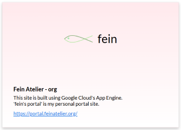

## プロジェクト名
> **Fein Atelier - org**

ドメインが「feinatelier.org」なので、そのまんまですね。 
特定の話題に絞ってるタイプのWebサイトではないので。

## URL
https://feinatelier.org/ 
こちらが「Fein Atelier - org」で、メインのWebサイトです。

https://portal.feinatelier.org/ 
こちらが「fein's portal」で、名の通りポータルサイトです。

## 概要
https://feinatelier.org/は、いわゆる「プログレッシブウェブアプリ」です。 
基礎的なフロントエンド技術と、PythonのFlaskを使用して構築されています。

[Fein Atelier - org](https://feinatelier.org/) 

[fein's portal](https://portal.feinatelier.org/)

## 仕様
大まかな仕様は次の通りです。 
GCPにデプロイされたWebサイトなんだけど、PWAとしているんですよね。 
それで、アプリとしても使えるようになっています。

##### サーバー
- Google Cloud App Engine ( Python runtime )
- Google Sites ( Google document )

##### 設定ファイル
- YAML

##### Web言語
- HTML
- CSS
- XML

##### プログラム
- JavaScript
- Python (Flask)
- Lua

##### バックアップ
- Microsoft 365
- GitHub

## 推奨動作環境

十分に調べましたが、万が一間違いがあれば訂正いたします。

##### Microsoft Edge
- **対応バージョン:** バージョン 18 以上
- **対応OSバージョン:** Windows 10 April 2018 Update 以上
- **リリース年:** 2018年

##### Google Chrome
- **対応バージョン:** バージョン 32 以上
- **対応OSバージョン:** Android 4.4 以上、Windows 7 以上、macOS 10.9 以上
- **リリース年:** 2014年

##### Mozilla Firefox
- **対応バージョン:** バージョン 65 以上
- **対応OSバージョン:** Windows 7 以上、macOS 10.12 以上
- **リリース年:** 2019年

##### Safari
- **対応バージョン:** バージョン 14 以上
- **対応OSバージョン:** iOS 14 以上、macOS Big Sur (11.0) 以上
- **リリース年:** 2020年

##### Opera
- **対応バージョン:** バージョン 19 以上
- **対応OSバージョン:** Android 4.4 以上、Windows 7 以上、macOS 10.9 以上
- **リリース年:** 2014年

## ロゴマーク
当Webサイトのロゴマークです。 

## サイト制作の背景事情
基礎的なフロントエンド技術を中心に構成しておけば、Webサイトを引っ越ししたくなっても簡単です。 
でも特定のサイト作成サービスは使いません。 
コンテンツの中身がそのサービス運営会社の所有物となり、サイトが大きくなればなるほど移転が現実的でなくなるからです。

## 今後の予定
とりあえず当面はHTML・CSS・JavaScriptでWebページを作りまくっていきます。 
つい先日.orgドメインにしたので、それが定着するまではシステム改変はしないつもり。

## analysis_history
分析日: 2025-11-27 
ディレクトリ全体のサイズ＝1.68 GB 
HTMLファイル＝138 
CSSファイル＝33 
JavaScriptファイル＝41 
PDFファイル＝221 
Pythonファイル＝4 
YAMLファイル＝3 
XMLファイル＝1 
txtファイル＝4 
JSONファイル＝2 
JPEGファイル＝6 
JPGファイル＝1996 
PNGファイル＝446 
WebPファイル＝164 
総コード行数＝167882 行

#### https://feinatelier.org/readme について
直接GitHubのREADME.mdをご覧いただける方のために、[README_GitHub](https://feinatelier.org/readme)のご案内です。─ Webページをご覧いただいている方については、今見ているWebページですよ？ ─ 
私自身も当サイトの仕様書を常時確認したいと思っています。 
そこで、GitHubのREADME.mdを、アクセスが手軽なWebページ [README_GitHub](https://feinatelier.org/readme) へリアルタイムで反映させております。 
よろしければ、ご活用いただけると幸いです。
